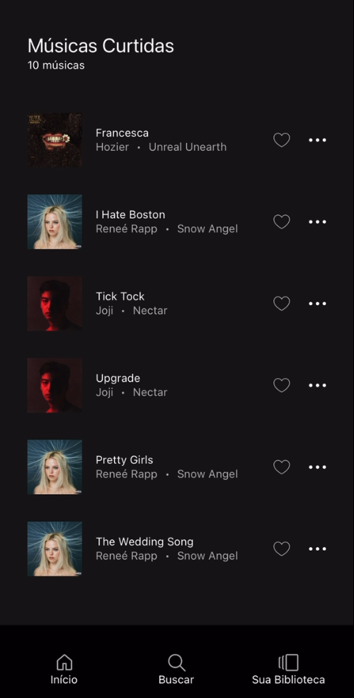

# spotify-like 🎧

 [wakatime](https://wakatime.com/badge/user/63a62ebf-02b8-40ab-b01b-99f672dace05/project/018dc4a4-4bfc-4c1e-8407-957d2b257dcc.svg) 

Expo app recriando as principais funcionalidades de interface e navegação do spotify como prática de react-native.

-  **React**  
-  **Tailwind CSS**  

## Funcionalidade
- Pesquisar e curtir músicas
- Pagina de cada album e artista
- Histórico de músicas recem curtidas e ultimos artistas acessados
- CRUD de playlists
- Armazenamento local de playlists e histórico

  
[https://youtube.com/shorts/f2fvwzhoI-Y](https://youtube.com/shorts/f2fvwzhoI-Y)
